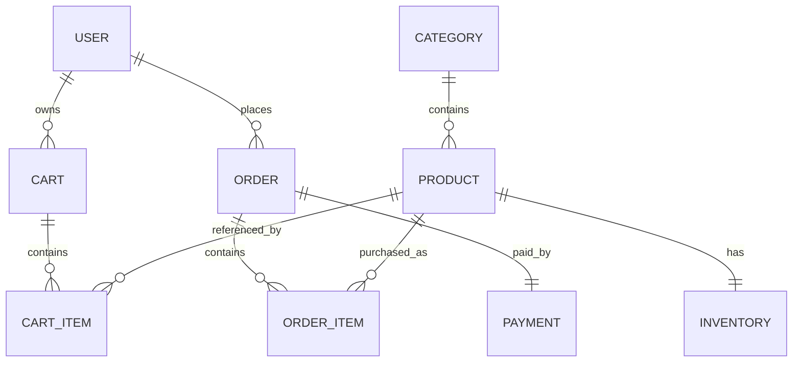
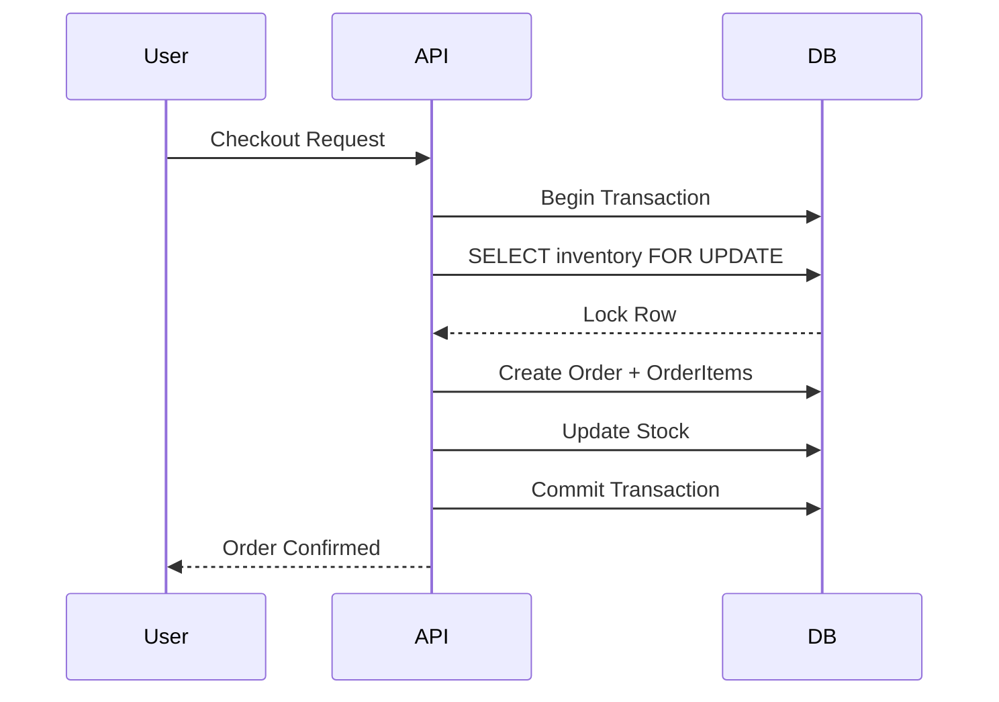
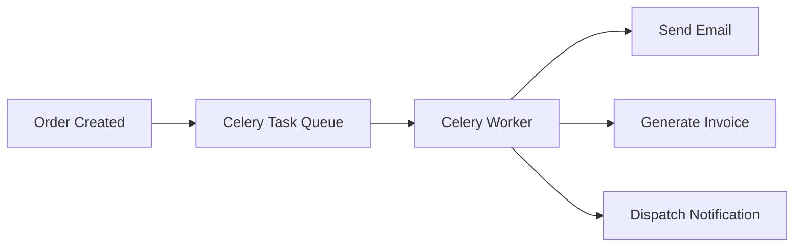

# 🛒 Production-Grade E-Commerce Backend

A **production-oriented e-commerce backend** built using **Django, Django REST Framework, PostgreSQL, Redis, and Celery**.

The system exposes **versioned REST APIs (`/api/v1/`)** that power a React frontend and supports the complete commerce workflow:

- User Authentication
- Product Catalog
- Category Browsing
- Shopping Cart
- Checkout Workflow
- Order Management
- Payment Processing
- Notifications
- Admin Analytics

The architecture is designed to be **scalable, modular, and production-ready**. :contentReference[oaicite:1]{index=1}


---

# 🚀 Tech Stack

### Backend

- **Django**
- **Django REST Framework**
- **PostgreSQL**
- **Redis**
- **Celery**
- **Celery Beat**
- **JWT Authentication**

### Frontend

- **React**
- **Vite**
- **React Router**
- **Axios**
- **TailwindCSS**

---

# 📌 Core Features

✔ User Authentication (JWT)  
✔ Product Catalog with search/filter/pagination  
✔ Category hierarchy  
✔ Shopping Cart system  
✔ Checkout with **inventory locking**  
✔ Order history  
✔ Payment processing  
✔ Notification system  
✔ Admin role-based endpoints  
✔ Redis caching for read-heavy endpoints  
✔ Celery background workers  

These capabilities define the domain modules of the system. :contentReference[oaicite:2]{index=2}

---

# 🌐 API Versioning

All APIs follow **versioned routing**:

```

/api/v1/

```

Examples:

```

POST /api/v1/auth/login
GET  /api/v1/products

````

Versioning allows safe API evolution without breaking clients. :contentReference[oaicite:3]{index=3}

---

# 🏗 System Architecture

```mermaid
flowchart TD

A[React Frontend]

A -->|HTTP JSON| B[Django REST API]

B --> C[Authentication Layer JWT]

B --> D[Domain Applications]

B --> E[Core Infrastructure]

E --> F[Logging Middleware]
E --> G[Exception Handler]
E --> H[Pagination]
E --> I[Rate Limiting]

B --> J[(PostgreSQL Database)]

B --> K[(Redis Cache)]

B --> L[Celery Worker]

L --> M[Async Tasks]

````

The backend follows a **layered architecture separating infrastructure from domain logic**. 

---

# 📂 Project Structure

```
backend
│
├── manage.py
├── requirements.txt
│
├── apps
│   └── accounts
│
├── core
│   ├── responses.py
│   ├── exceptions.py
│   ├── middleware.py
│   ├── throttling.py
│   ├── pagination.py
│   ├── models.py
│   └── serializers.py
│
└── config
    ├── settings.py
    ├── urls.py
    ├── asgi.py
    └── wsgi.py
```

Architecture responsibilities:

| Layer  | Responsibility        |
| ------ | --------------------- |
| apps   | domain logic          |
| core   | shared infrastructure |
| config | Django configuration  |


---

# 🧱 Database Architecture



---

# 🛍 Core Data Models

### User

```
id
email
password
role (ADMIN / CUSTOMER)
is_active
created_at
```

### Product

```
id
name
description
price
category_id
is_active
created_at
updated_at
```

### Order

```
id
user_id
total_price
status
```

### OrderItem

```
order_id
product_id
quantity
price_snapshot
```

`price_snapshot` ensures historical price integrity. 

---

# 🧾 Checkout Transaction Strategy

Checkout uses **database transactions with row locking**.



This prevents **race conditions and overselling**. 

---

# ⚡ Redis Caching Strategy

Cached endpoints:

```
GET /products
GET /categories
```

Not cached:

```
cart
orders
payments
```

Cache TTL:

```
10 minutes
```


---

# ⚙️ Background Jobs

Handled using **Celery workers**.

Example tasks:

* Order confirmation email
* Invoice generation
* Notification dispatch
* Analytics updates




---

# 🔐 Security

Security mechanisms implemented:

* JWT Authentication
* Role-based access control
* Rate limiting
* Request logging
* Standardized error responses
* Admin-only endpoints

Admin APIs require:

```
role = ADMIN
```


---

# 📡 API Surface

Major API groups:

```
Auth APIs
User APIs
Address APIs
Product APIs
Category APIs
Cart APIs
Checkout APIs
Order APIs
Payment APIs
Review APIs
Notification APIs
Admin APIs
Health API
```

Total expected endpoints:

```
≈ 50 APIs
```


---

# 🗺 Development Roadmap

### Phase 1 — Platform Foundation ✅

* Custom user model
* JWT authentication
* Core infrastructure layer
* API response standardization

### Phase 2 — Catalog System (Next)

* Categories
* Products
* Inventory

### Phase 3 — Cart

* Cart lifecycle
* Cart items

### Phase 4 — Checkout

* Inventory locking
* Order creation

### Phase 5 — Payments

* Payment intent
* Confirmation

### Phase 6 — Notifications & Analytics

* Notification system
* Admin dashboard


---

# 👨‍💻 Author

Built as a **production-grade backend architecture project** demonstrating:

* scalable Django architecture
* real-world e-commerce workflows
* asynchronous processing
* distributed system design

---

# ⭐ Future Improvements

* ElasticSearch product search
* CDN for product images
* Distributed caching
* Event-driven architecture
* Kubernetes deployment

---
